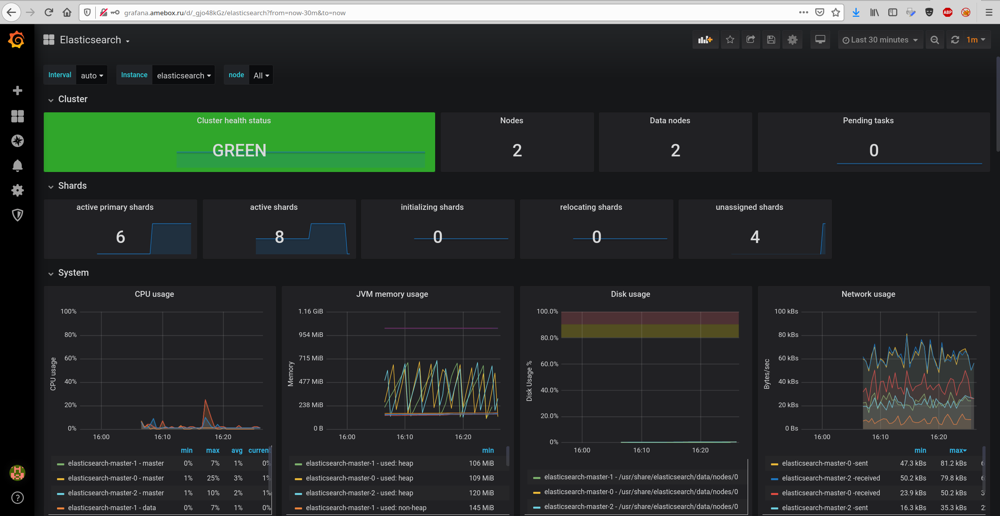
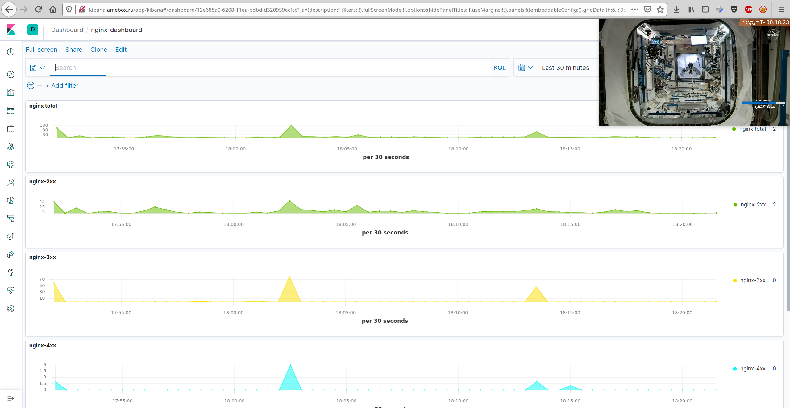

*# kubernetes-logging

Кластер

```bash
gcloud beta container --project "docker-263219" \
clusters create "cluster" \
--zone "europe-west3-c" \
--no-enable-basic-auth \
--cluster-version "1.14.10-gke.36" \
--machine-type "n1-standard-2" \
--image-type "COS" \
--disk-type "pd-standard" \
--disk-size "100" \
--metadata disable-legacy-endpoints=true \
--scopes "https://www.googleapis.com/auth/devstorage.read_only","https://www.googleapis.com/auth/logging.write","https://www.googleapis.com/auth/monitoring","https://www.googleapis.com/auth/servicecontrol","https://www.googleapis.com/auth/service.management.readonly","https://www.googleapis.com/auth/trace.append" \
--num-nodes "1" \
--no-enable-stackdriver-kubernetes \
--enable-ip-alias \
--network "projects/docker-263219/global/networks/default" \
--subnetwork "projects/docker-263219/regions/europe-west3/subnetworks/default" \
--default-max-pods-per-node "110" \
--no-enable-master-authorized-networks \
--addons HorizontalPodAutoscaling,HttpLoadBalancing \
--no-enable-autoupgrade \
--no-enable-autorepair \
&& gcloud beta container --project "docker-263219" \
node-pools create "infra-pool" \
--cluster "cluster" \
--zone "europe-west3-c" \
--node-version "1.14.10-gke.36" \
--machine-type "n1-standard-2" \
--image-type "COS" \
--disk-type "pd-standard" \
--disk-size "100" \
--metadata disable-legacy-endpoints=true \
--node-taints node-role=infra:NoSchedule \
--scopes "https://www.googleapis.com/auth/devstorage.read_only","https://www.googleapis.com/auth/logging.write","https://www.googleapis.com/auth/monitoring","https://www.googleapis.com/auth/servicecontrol","https://www.googleapis.com/auth/service.management.readonly","https://www.googleapis.com/auth/trace.append" \
--num-nodes "3" \
--no-enable-autoupgrade \
--no-enable-autorepair
```

Hipster-shop

```bash
kubectl create ns microservices-demo
kubectl apply -f https://raw.githubusercontent.com/express42/otus-platform-snippets/master/Module-02/Logging/microservices-demo-without-resources.yaml -n microservices-demo
```

ELK / EFK

```bash
helm repo add elastic https://helm.elastic.co
kubectl create ns observability
helm upgrade --install elasticsearch elastic/elasticsearch --namespace observability
helm upgrade --install kibana elastic/kibana --namespace observability
helm upgrade --install fluent-bit stable/fluent-bit --namespace observability
```

после внесения изменений

```bash
helm upgrade --install elasticsearch elastic/elasticsearch --namespace observability -f elasticsearch.values.yaml
helm upgrade --install kibana elastic/kibana --namespace observability -f kibana.values.yaml
helm upgrade --install fluent-bit stable/fluent-bit --namespace observability  -f fluent-bit.values.yaml
```

Добавляем prometheus-operator

```bash
helm upgrade --install prometheus stable/prometheus-operator --namespace=observability -f prometheus-operator.values.yaml
```

Добавляем Elasticsearch exporter

```bash
helm upgrade --install elasticsearch-exporter stable/elasticsearch-exporter \
--set es.uri=http://elasticsearch-master:9200 \
--set serviceMonitor.enabled=true \
--namespace=observability
```

Вытесняем ноду

```bash
kubectl drain <NODE_NAME> --ignore-daemonsets
```

Возвращаем ноду

```bash
kubectl  uncordon<NODE_NAME>
```

Установка Loki

```bash
helm repo add loki https://grafana.github.io/loki/charts

helm upgrade --install loki --namespace=observability loki/loki
helm upgrade --install promtail loki/promtail --set "loki.serviceName=loki" --namespace=observability -f loki-promtail.values.yaml
```




P.S. Для того что бы "уместиться" в данные ресурсы пришлось зажимать хотелки по CPU для Kibana.
