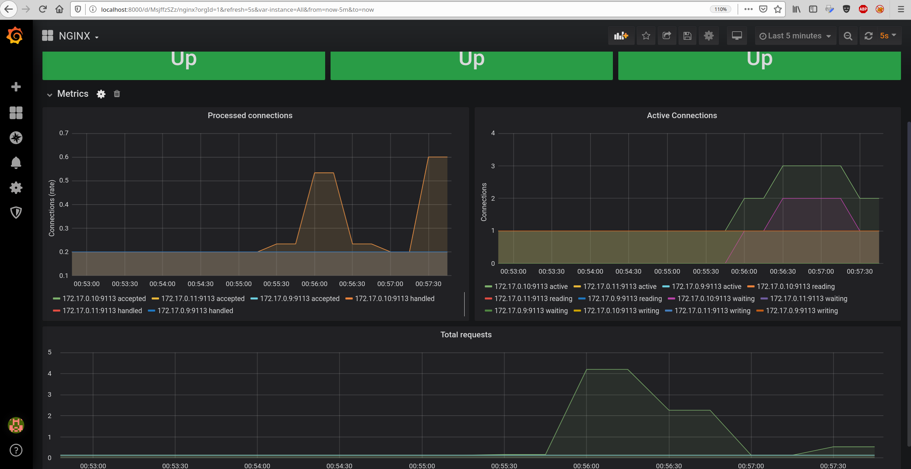

# kubernetes-monitoring

Работа выполянлась на minikube

```shell
kubectl apply -f deployment.yaml
kubectl apply -f service.yaml
kubectl apply -f servicemonitor.yaml
```

```shell
kubectl apply -f ns.yaml
```

```shell
helm upgrade -i prometheus-operator stable/prometheus-operator -n prometheus --wait -f values.yaml
```

Пробрасываем порт Grafana

```shell
kubectl port-forward -n prometheus svc/prometheus-operator-grafana 8000:80
```

Импортируем [nginx dashboard](https://github.com/nginxinc/nginx-prometheus-exporter/blob/master/grafana/dashboard.json)

накручиваем активность на одном поде

```shell
kubectl port-forward nginx-755766648c-cjdm6 8080:8000
```


